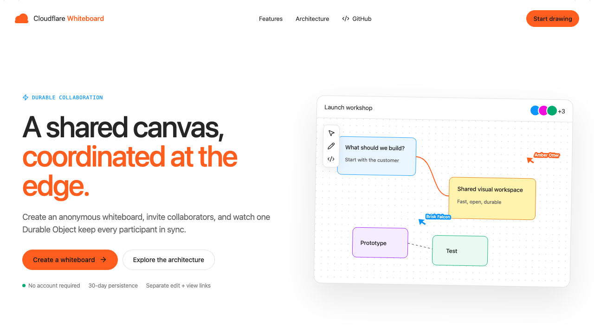
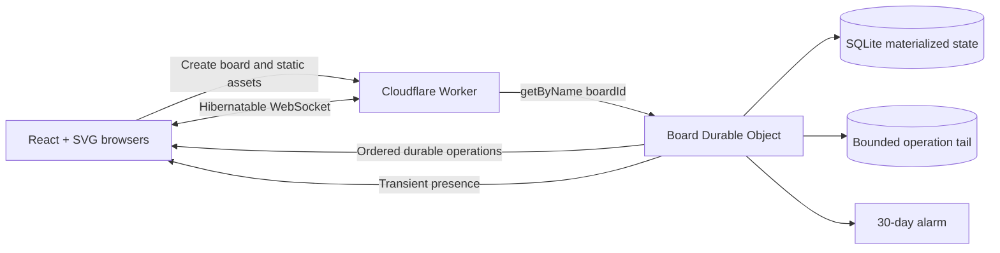

# Cloudflare Whiteboard

[](https://developers.cloudflare.com/workers/)
[](https://developers.cloudflare.com/durable-objects/)
[](https://react.dev/)
[](https://www.typescriptlang.org/)
[](LICENSE)

> An anonymous, real-time collaborative whiteboard where one SQLite-backed Durable Object per board orders edits, persists vector elements, and synchronizes live cursors over hibernatable WebSockets.

**Status:** This is a reference implementation shared as-is. Support is best-effort through GitHub Issues.

**[Open the live demo](https://cloudflare-whiteboard.dwarven.workers.dev)**



## Why this project exists

Realtime collaboration is an unusually good fit for Durable Objects: every board needs one authoritative coordination point, strongly consistent state, long-lived connections, and a lifecycle independent of any browser. This project keeps that architecture visible instead of hiding it behind a collaborative-editor framework.

The editor itself is built with React and SVG. It includes drawing, shapes, text, sticky notes, frames, grouping, locking, alignment, live presence, edit/view capability links, reconnect recovery, undo/redo, and PNG/SVG/JSON portability.

## Features

- Anonymous board creation with separate edit and view capability links
- Palette-first authoring: click a shape tile to place it at the center of the view, or drag the tile onto the board to drop it exactly where you want
- Consistent creation sizes keep diagrams tidy; every placed object opens its text editor immediately and wraps text as it grows
- Dragging a connector handle onto empty canvas creates the next node already wired to the source
- Marquee and shift multi-selection with shared movement, styling, deletion, alignment, duplication, locking, layering, and keyboard nudging
- Bound connectors stay attached when source or destination shapes move or resize, with configurable start and end arrowheads
- Pan, zoom, touch controls, fit-to-board, and responsive mobile toolbars
- Live collaborator cursors, selections, names, and connection status
- Per-user undo and redo
- PNG, standalone SVG, and versioned JSON export; validated JSON import
- Thirty-day sliding expiration driven by a Durable Object alarm
- Server-side element, message, connection, and operation-rate limits
- High-contrast light palette using the current Cloudflare Kumo product-page visual language

## Architecture



The Worker serves the Vite assets, creates capability tokens, rate-limits board creation, and routes each WebSocket to `env.BOARDS.getByName(boardId)`. The board's Durable Object validates permissions, assigns a monotonic sequence to each mutation, writes canonical state to its embedded SQLite database, and broadcasts only after persistence succeeds.

Cursor traffic never touches storage. Clients send transient presence at a bounded rate while committed pointer-up changes use the durable operation path.

## Collaboration model

Cloudflare Whiteboard intentionally uses server ordering rather than a CRDT:

1. The browser applies its own mutation optimistically.
2. The board Durable Object validates and serializes the mutation.
3. SQLite stores the materialized element and a bounded operation record.
4. Every connection receives the canonical operation and server sequence.
5. A reconnecting browser receives an operation delta when possible, or a full snapshot otherwise.

Operations use unique `opId` values, making reconnect retries idempotent. Changes to distinct elements never conflict. Two users changing the same element converge according to the Durable Object's total order, with the last accepted value winning.

See [docs/protocol.md](docs/protocol.md) for message details and [docs/threat-model.md](docs/threat-model.md) for the capability-link security model.

## Data model

Each Durable Object creates three SQLite tables:

| Table        | Purpose                                                        |
| ------------ | -------------------------------------------------------------- |
| `meta`       | Capability hashes, title, sequence, timestamps, and expiration |
| `elements`   | Current materialized vector elements and tombstones            |
| `operations` | Bounded reconnect and idempotency tail                         |

The `elements` table is the snapshot. The operation tail is pruned after 2,000 entries, so storage does not grow with the full editing history.

## Security and privacy

- Tokens contain 192 random bits and are stored only as SHA-256 hashes on the server. The creator's browser temporarily keeps plaintext share links in session storage.
- Tokens use URL fragments, which browsers do not send in HTTP requests or referrers.
- A token is transmitted in the first encrypted WebSocket message and checked inside the Durable Object.
- View-only permissions are enforced on every mutation server-side.
- Content and tokens are excluded from structured logs.
- User text is rendered as React text nodes; raw HTML, foreign SVG, and arbitrary uploads are unsupported.
- Responses set a strict CSP, `no-referrer`, framing denial, and restricted browser permissions.

Anyone possessing a capability link can use it. Version one does not include accounts, ownership recovery, or link revocation. Do not store confidential information on the public demo.

## Prerequisites

- Node.js 22 or newer
- npm
- A Cloudflare account for deployment
- Wrangler authentication through `npx wrangler login`

Durable Objects are available on Workers Free and Paid plans. Check the current [Durable Objects pricing](https://developers.cloudflare.com/durable-objects/platform/pricing/) before operating a public deployment.

## Local development

```bash
git clone https://github.com/Gryczka/cloudflare-whiteboard.git
cd cloudflare-whiteboard
npm install
npm run cf-typegen
npm run dev
```

Open the local URL shown by Vite. Durable Object SQLite state is simulated locally and persisted under `.wrangler/`.

No secrets are required for the default project. The Rate Limiting binding is simulated during local development.

## Testing

```bash
npm run lint
npm run typecheck
npm test
npm run build
```

Tests run inside workerd through `@cloudflare/vitest-pool-workers`, covering reducers, cryptographic capabilities, Worker board creation, and Durable Object idempotent initialization.

## Deployment

Review the generated upload without publishing:

```bash
npm run deploy:dry-run
```

Deploy the Worker and its static assets:

```bash
npm run deploy
```

Wrangler uses the account associated with your current login. The repository intentionally does not commit an account ID or tenant-specific resource IDs.

The deployment creates the SQLite-backed Durable Object namespace from migration `v1`. Never edit an existing migration after deployment; append a new migration tag for future class changes.

## Configuration

Public-demo limits are defined in `src/shared/protocol.ts` and `wrangler.jsonc`:

| Limit                   |             Default |
| ----------------------- | ------------------: |
| Board creation          | 5 per IP per minute |
| Connections per board   |                  30 |
| Elements per board      |               2,000 |
| Application message     |              64 KiB |
| Messages per connection |       40 per second |
| Retained operations     |               2,000 |
| Inactivity retention    |             30 days |

## Project structure

```text
src/
├── client/
│   ├── editor/       # SVG canvas, tools, inspector, export
│   ├── landing/      # Cloudflare Kumo product landing page
│   ├── realtime/     # WebSocket lifecycle and reconciliation
│   └── styles/       # Responsive Kumo design system
├── server/
│   └── board-do.ts   # SQLite, capabilities, ordering, presence, expiry
├── shared/           # Board model, protocol, limits, crypto
└── index.ts          # Worker entrypoint and request routing
test/                 # Worker-runtime Vitest suite
```

## Known limitations

- Same-element concurrent edits use deterministic last-writer-wins semantics rather than a CRDT.
- Capability links cannot be rotated or revoked.
- Offline edits are retained only during the current browser session and reconnect window.
- Arbitrary image uploads are intentionally excluded from the anonymous public sample.
- SVG spatial editing has partial screen-reader support; surrounding application controls target WCAG 2.1 AA.
- This is a reference project, not an SLA-backed hosted service.

## Contributing

Contributions are welcome. Read [CONTRIBUTING.md](CONTRIBUTING.md), follow the [Code of Conduct](CODE_OF_CONDUCT.md), and run `npm run check` before opening a pull request.

## License

MIT. See [LICENSE](LICENSE).

## Acknowledgements

- [Cloudflare Workers](https://developers.cloudflare.com/workers/)
- [Durable Objects](https://developers.cloudflare.com/durable-objects/)
- [React](https://react.dev/)
- [Lucide](https://lucide.dev/)

Cloudflare is a trademark of Cloudflare, Inc. This is an unofficial sample project and is not an official Cloudflare product.
